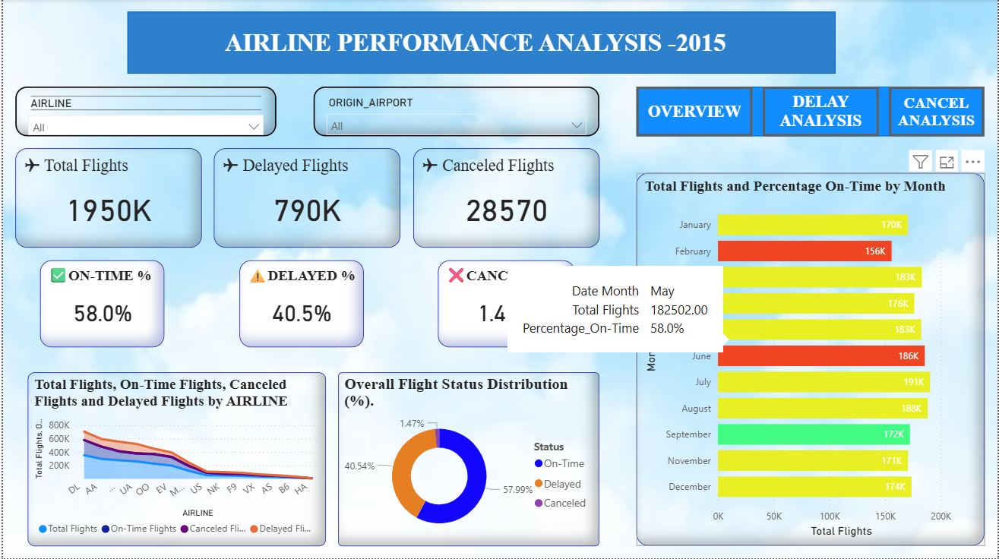
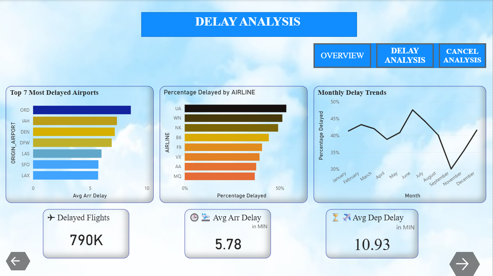

# Flight Delay & Cancellation Analysis (Power BI)

## 📊 Overview
This Power BI dashboard analyzes flight delays and cancellations to identify patterns and key factors affecting airline performance.

## 📌 Features
- Delay trends analysis
- Cancellation insights
- Interactive filters
- KPI metrics

## 🛠 Tools Used
- Power BI
- Data Visualization

## 📸 Dashboard Preview

## 📥 How to Use
Download the .pbix file and open using Power BI Desktop.
